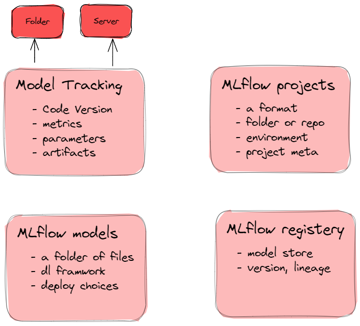
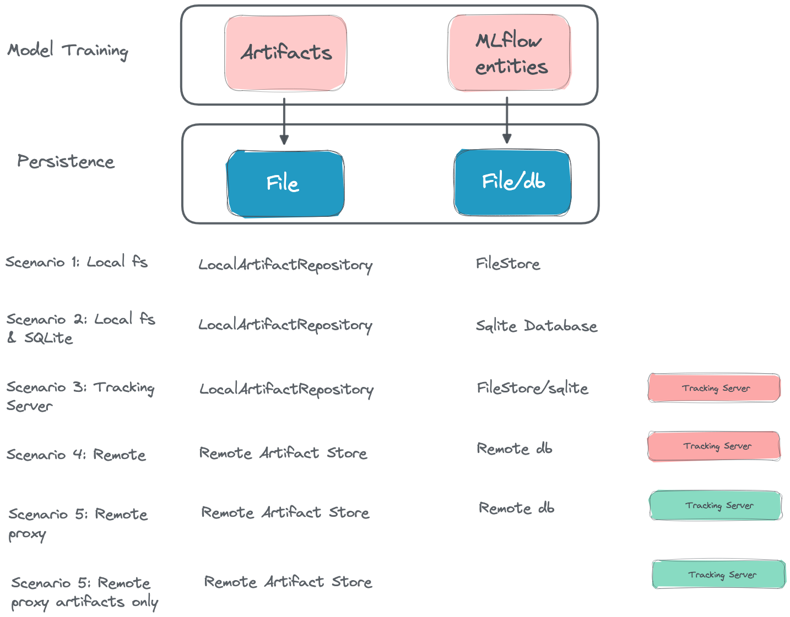
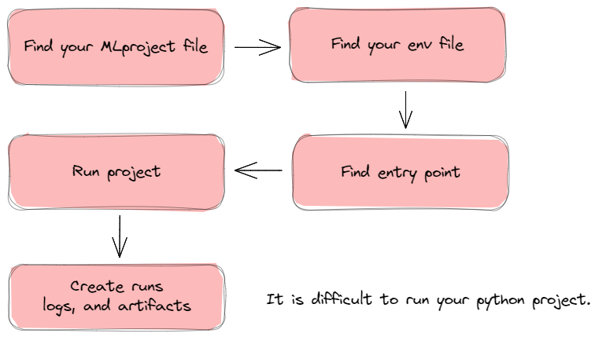

# MLflow Concepts

就看着一张图，大概知道mlflow的核心概念了
      

## 1. MLflow Tracking concept
Tracking以runs的概念组织，执行同一个data science code多次，产生多次runs，记录每次运行中需要跟踪的各种参数。

- 代码版本。
- 运行起始和结束时间。
- 源，从哪个文件，项目或者entry point开始运行的。
- parameters, 键值对。
- metrics，模型运行结果或者过程中产生的指标。
- Artifacts，各种文件。

Runs存储在什么地方？
- 本地文件系统
- SqlAlchemy compatible database
- 远程tracking服务器

track到远程可以设置环境变量 `MLFLOW_TRACKING_URI`, 也可以在代码中设置 `mlflow.set_tracking_uri()`

URI 可选项
- 本地文件系统 (`file:/my/local/dir`)
- 数据库 `<dialect>+<driver>://<username>:<password>@<host>:<port>/<database>`. 
- HTTP 服务器 (`https://my-server:5000`)
- Databricks 工作空间 (`databricks://<profileName>`）


## 2.How to track?


https://mlflow.org/docs/latest/tracking.html


## 3. Mlflow project

A folder contains
- MLproject file
- Environment definition file
- python code files


     

Other data science use mlflow to run your project


```yaml
name: My Project                         # 项目名称

python_env: python_env.yaml              # 环境文件名，必须在当前文件夹能找到
# or
# conda_env: my_env.yaml
# or
# docker_env:
#    image:  mlflow-docker-example

entry_points:
  main:                                  # 第一个entry point，定义参数，运行命令
    parameters:
      data_file: path
      regularization: {type: float, default: 0.1}
    command: "python train.py -r {regularization} {data_file}"
  validate:                              # 第二个entry point
    parameters:
      data_file: path
    command: "python validate.py {data_file}"
```

```yaml
# 选择python版本
python: "3.8.15"
# Dependencies required to build packages. This field is optional.
build_dependencies:
  - pip
  - setuptools
  - wheel==0.37.1
# python包依赖
dependencies:
  - mlflow
  - scikit-learn==1.0.2
```

[mlflow project definition](https://mlflow.org/docs/latest/projects.html#project-directories)


